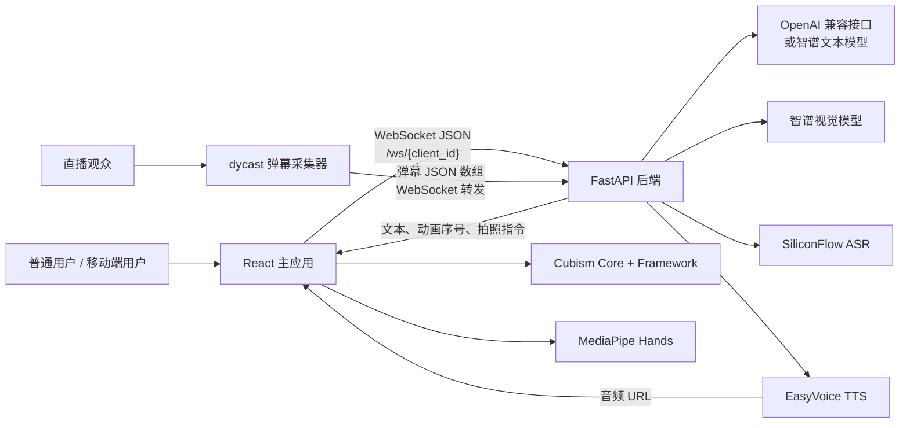
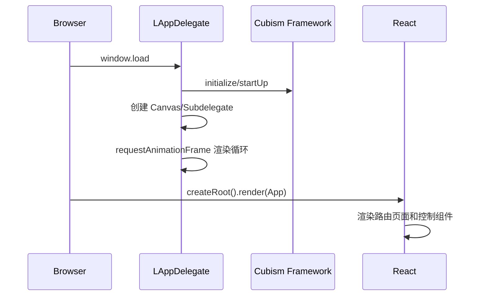
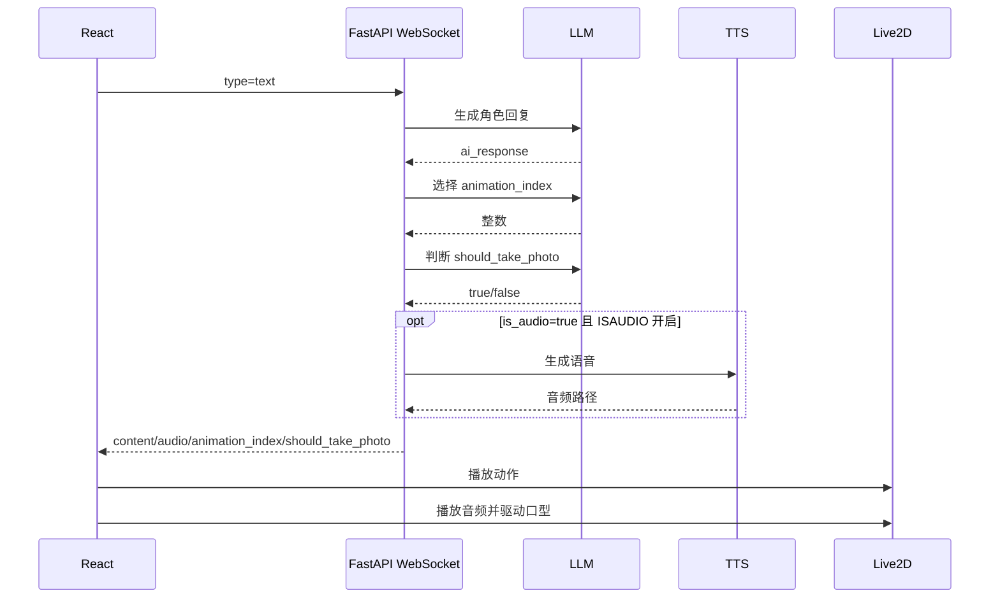
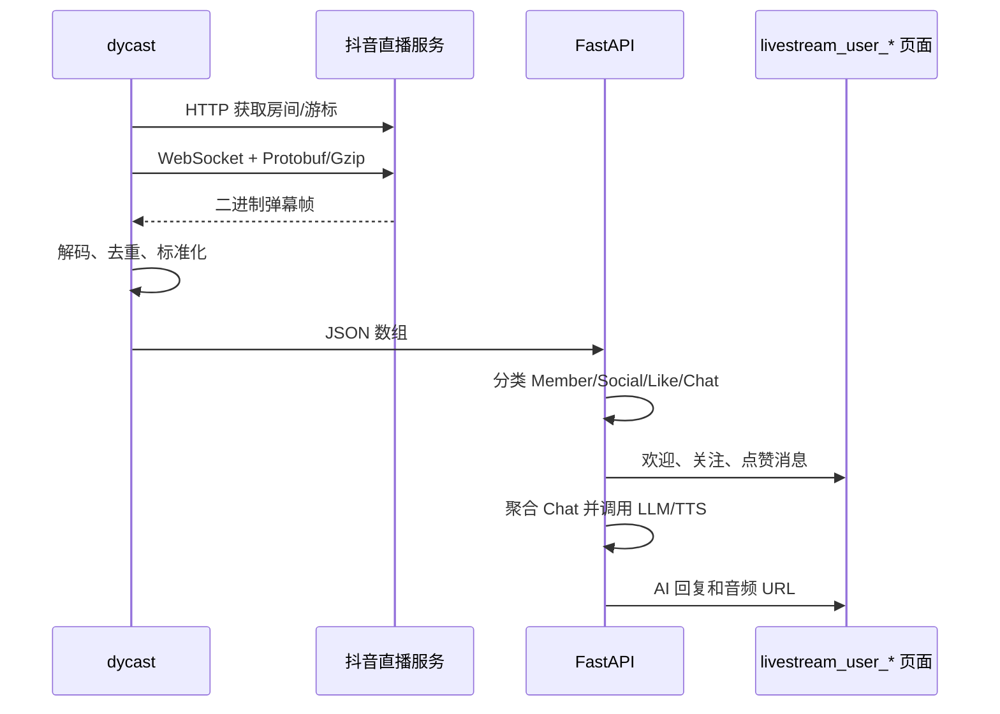
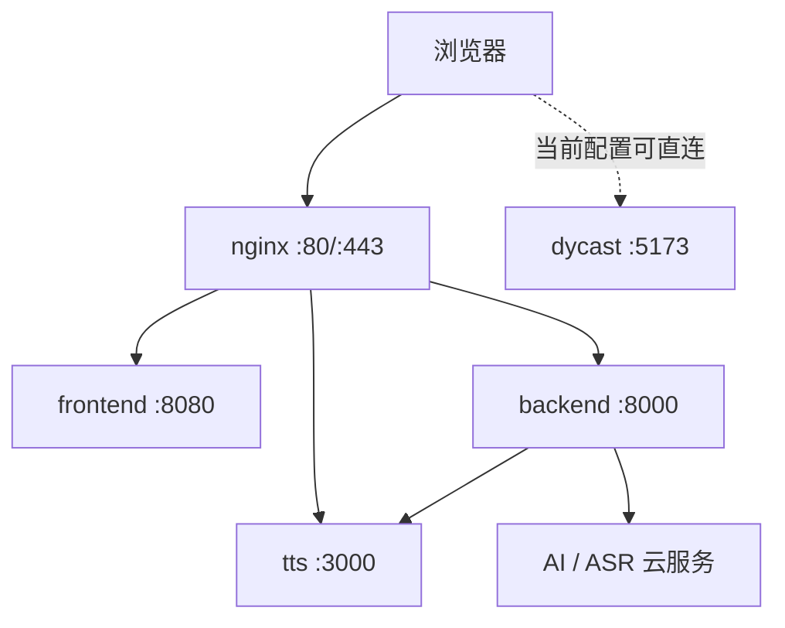

# 系统架构文档

## 1. 文档范围

本文描述“小凡 AI”当前实现的系统结构。系统目标是将 Live2D 数字人渲染、文字/语音/图片对话、TTS 口型同步和抖音直播弹幕互动组合为浏览器端虚拟人应用。

不在本文范围内：

- Live2D SDK 内部算法与模型文件格式细节；
- 抖音私有协议的完整逆向说明；
- 第三方 AI、TTS、ASR 服务本身的实现。

## 2. 架构概览



### 2.1 架构风格

- **浏览器富客户端**：UI、Live2D 渲染、音频播放、摄像头/麦克风采集均在浏览器完成。
- **事件驱动通信**：前后端通过 WebSocket 双向推送，消息以 JSON 封装。
- **分层后端**：入口/连接管理、消息处理器、外部服务访问三层。
- **多模型编排**：一次文字请求最多触发对话生成、动画选择、拍照判断三次模型调用。
- **旁路直播采集**：`dycast` 不进入主前端代码，而是独立采集并转发弹幕。

## 3. 代码仓库结构

```text
CubismWebSamples/
├── BackendProject/                    # FastAPI 后端
│   ├── main.py                        # 应用入口、连接管理、消息分发
│   ├── handlers/
│   │   ├── audio_handler.py           # 音频分块缓存与 ASR
│   │   ├── image_handler.py           # 图片校验与视觉模型调用
│   │   └── comment_handler.py         # 直播评论聚合与回复
│   └── services/
│       ├── llm_service.py             # 文本/视觉模型适配
│       └── http_service.py            # TTS、ASR HTTP 调用
├── FrontendProject/
│   ├── Resources/                     # Live2D 模型、动作、贴图和背景
│   └── TypeScript/AI/
│       ├── src/
│       │   ├── App.tsx                # 路由和页面装配
│       │   ├── pages/                 # 移动端、直播页
│       │   ├── components/            # 对话、动作、音频、缩放、手势控件
│       │   ├── websocketmanager.ts    # WebSocket 单例
│       │   └── lapp*.ts               # Cubism 示例层及扩展
│       └── copy_resources.js          # 构建前复制 Core/模型资源
├── Core/                              # Cubism Core 运行库
├── Framework/                         # Cubism Framework 子模块
├── dycast/                            # Vue 抖音弹幕采集与转发应用
├── nginx/nginx.conf                   # 统一入口反向代理
└── docker-compose.yml                 # 五服务编排
```

说明：`.gitmodules` 同时声明了 `Framework` 和 `dycast`，但当前 Git 索引中只有 `Framework` 是 gitlink；`dycast` 当前以普通目录文件纳入主仓库。更新依赖时不能假定两者都可用同一种子模块命令维护。

## 4. 逻辑分层与职责

### 4.1 表现与交互层

| 模块 | 职责 |
| --- | --- |
| `App.tsx` | 提供 `/`、`/mobile`、`/livestream` 三个路由 |
| `WebSocketPanel.tsx` | 桌面聊天、语音录制、摄像头拍照、消息展示 |
| `MobilePage.tsx` | 移动端文字/语音入口 |
| `LiveStreamPage.tsx` | 直播展示页，只消费后端推送 |
| `MotionControls.tsx` 等 | 动作、缩放、音频、手势调试控制 |

### 4.2 Live2D 运行层

| 模块 | 职责 |
| --- | --- |
| `LAppDelegate` | 初始化 Cubism、创建 Canvas、驱动渲染循环、管理输入事件 |
| `LAppSubdelegate` | 每个 Canvas 的 WebGL、视图、纹理和模型管理器组合 |
| `LAppLive2DManager` | 模型切换、动作播放、音频管理器持有 |
| `LAppModel` | 模型资源加载、动作/表情/物理计算、绘制、口型参数更新 |
| `LAppAudioManager` | 音频解码播放、RMS 计算、播放状态回调 |
| `HandGestureService` | MediaPipe Hands 推理及手指/手臂状态映射 |

### 4.3 通信与应用服务层

`WebSocketManager` 是前端全局单例，负责：

- 连接状态：`disconnected / connecting / connected / error`；
- 自动重连：固定 3 秒，最多 5 次；
- 协议消息序列化；
- 接收消息转为 UI `DisplayMessage`；
- 将 `animation_index`、`should_take_photo` 转为浏览器自定义事件。

后端 `ConnectionManager` 负责：

- `client_id -> WebSocket` 映射；
- 活跃连接集合；
- 每个客户端的 LangChain 消息历史；
- 点对点发送和全体广播。

### 4.4 业务处理层

| 处理器 | 输入 | 主要输出 |
| --- | --- | --- |
| `handle_text_message` | 文本、模型名、语音开关 | AI 回复、动作序号、可选拍照指令、可选音频 URL |
| `handle_image_message` | Base64 图片、提示词 | 视觉分析回复、可选音频 URL |
| `handle_audio_message` | Base64 音频块 | 当前仅缓存音频块 |
| `handle_control_message` | 开始/结束音频流 | ASR 文本，再进入文字对话链路 |
| `handle_comment_message` | dycast 消息数组 | 欢迎/关注/点赞话术，或聚合评论 AI 回复 |

### 4.5 外部服务适配层

- `LLMService`
  - `MODEL_TYPE=openai`：使用 LangChain `ChatOpenAI`，支持自定义 `OPENAI_BASE_URL`。
  - `MODEL_TYPE=zhipu`：使用智谱 SDK 的文本模型。
  - 图片分析始终依赖智谱视觉模型，与文本引擎选择无关。
- `HTTPService`
  - EasyVoice：`POST /api/v1/tts/generate`。
  - SiliconFlow：`POST /v1/audio/transcriptions`。

## 5. 核心运行链路

### 5.1 启动与渲染



React UI 与 Canvas 由同一页面承载，但生命周期相对独立；React 组件通过 `LAppDelegate.getInstance()` 访问 Live2D 管理器。

### 5.2 文字对话



### 5.3 语音输入

浏览器使用 `MediaRecorder` 产生 `audio/webm;codecs=opus` 数据，每 100ms 发送一个 Base64 块；停止时发送结束块和 `stop_audio_stream`。后端将所有块直接拼接后以 `.wav` 文件名保存，再交给 ASR。

这是当前实现的重要约束：协议字段写作 `audioFormat: "pcm"`、文件扩展名写作 `.wav`，实际浏览器数据却是 WebM/Opus。是否可识别取决于第三方 ASR 的容错能力，不能将其视为严格 WAV/PCM 流。

### 5.4 图片对话与自动拍照

1. 用户主动拍照，或后端在文字对话中返回 `should_take_photo=true`。
2. 前端打开摄像头，将视频帧编码为 JPEG Base64。
3. 后端用 Pillow 验证格式，再调用智谱视觉模型。
4. 图片分析结果加入当前客户端会话历史并返回。

### 5.5 直播弹幕



## 6. 数据与状态

当前没有数据库、Redis 或消息队列。

| 状态 | 保存位置 | 生命周期 |
| --- | --- | --- |
| WebSocket 连接 | FastAPI 进程内存 | 连接期间 |
| 普通对话历史 | `ConnectionManager.message_history` | 进程生命周期；断开时未主动清理 |
| 直播评论历史 | `CommentProcessor.message_history` 全局列表 | 进程生命周期，所有直播共用 |
| 音频块 | `AudioProcessor.audio_buffers` | 开始录音至完成处理 |
| 录音文件 | `BackendProject/audio_files` | 持久化，当前无清理策略 |
| UI 消息 | 浏览器内存，最多 100 条 | 页面生命周期 |
| dycast 去重集合 | 浏览器内存 | 单次房间连接 |

## 7. 部署拓扑

Compose 定义五个服务：



当前配置中的 Nginx 尚未配置 `dycast`、`/dylive`、`/socket` 代理，且 443 只有端口映射、没有 TLS `server` 块。因此图中的统一入口是目标拓扑，未完全由现有配置实现。

## 8. 质量属性评估

### 8.1 可用性

- 前端 WebSocket 有自动重连；
- dycast 有心跳和最多 3 次重连；
- Compose 设置 `restart: unless-stopped`；
- 外部服务失败时多数路径返回错误消息或空音频。

不足：没有服务健康检查、熔断、请求重试、调用超时分级和降级策略。

### 8.2 扩展性

- 前端静态资源可由 CDN/Nginx 横向扩展；
- 后端依赖本地内存状态，多个实例之间无法共享会话与连接；
- `livestream_user_` 广播依赖单进程连接表，不能直接多副本部署。

### 8.3 安全性

当前实现只适合受控环境：

- WebSocket 无认证和授权，`client_id` 由客户端自行声明；
- CORS 为 `*` 且允许凭据；
- 没有消息大小、频率和连接数限制；
- 图片和音频数据可造成内存/磁盘压力；
- 日志会打印完整消息对象及图片 Base64 预览；
- `.env` 为本机真实配置文件，必须保证不入库，并建议定期轮换密钥。

### 8.4 可观测性

目前依赖 `print`/`console.log`。缺少结构化日志、请求 ID、指标、链路追踪、告警和日志轮转。

## 9. 关键架构约束

1. Live2D Core/Framework 和模型资源必须与前端产物一起可访问。
2. 浏览器使用摄像头和麦克风时，除 `localhost` 外通常需要 HTTPS 安全上下文。
3. 图片能力必须配置智谱密钥，即使文字聊天使用 OpenAI 兼容服务。
4. 直播广播依赖接收端 `client_id` 以 `livestream_user_` 开头。
5. 当前后端应保持单实例，除非先引入共享会话、连接路由或消息总线。
