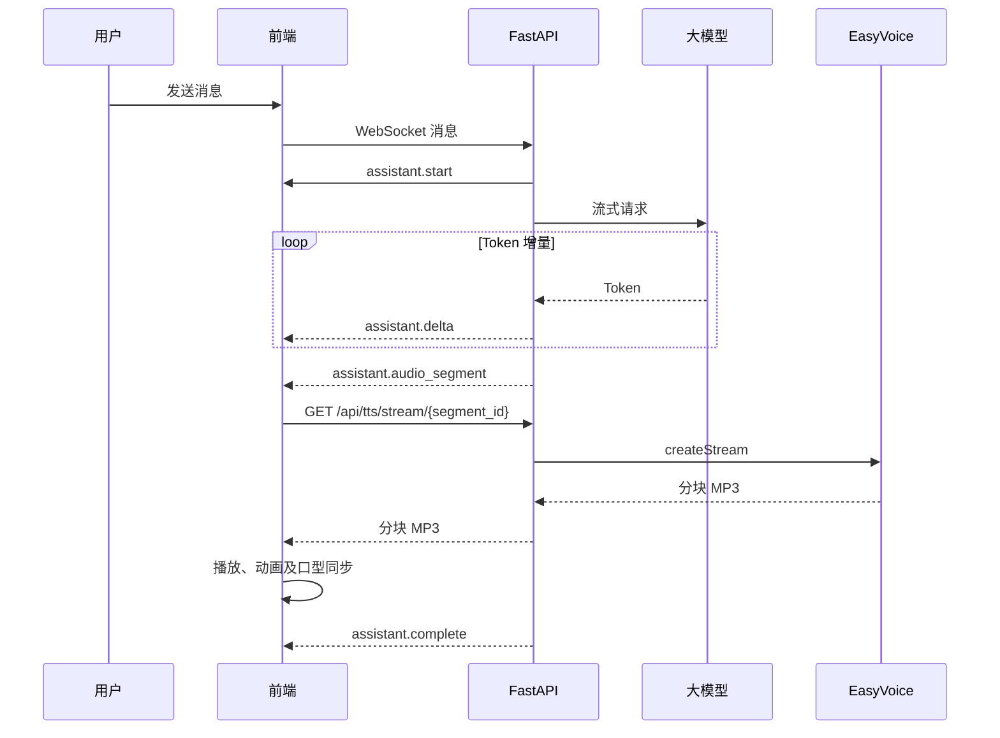

# 2026-08-14 至 2026-08-15 修改日志

> 分支：`develop`
>
> 代码基线：`798335b`
>
> 当前版本：`0485b11`
>
> 整理日期：2026-08-15

## 1. 修改概览

本轮调整完成了项目工程梳理、AI 女友多模式前端重构，以及普通聊天的流式文字和流式语音链路改造。

主要成果：

- 补齐架构、设计、协议和部署文档。
- 将单一页面重构为普通、升级、抖音直播三种使用模式。
- 增加语音输入、视觉控制、环境声音监测和直播控制台。
- 修复 Vite 使用备用端口时 WebSocket 连接错误的问题。
- 增加非流式回复的打字机展示效果。
- 将普通聊天升级为“流式文字 + 分句流式 TTS”。
- 保留 Live2D 动画、音频播放和口型同步能力。

## 2. 2026-08-14：工程梳理与方案设计

### 2.1 工程架构梳理

对现有 React、Live2D Cubism、FastAPI、EasyVoice、ASR 和抖音弹幕服务进行了模块划分，明确了：

- 前后端模块边界。
- WebSocket 核心通信链路。
- Live2D 模型、动画、音频和口型同步关系。
- 抖音弹幕采集、转发和自动回答流程。
- 外部大模型、TTS、ASR 服务依赖。
- 单进程内存会话与水平扩容限制。

新增文档：

- `docs/ARCHITECTURE.md`
- `docs/DESIGN.md`
- `docs/PROTOCOL.md`
- `docs/DEPLOYMENT.md`
- `docs/README.md`

### 2.2 前端重新规划

形成 AI 女友三模式设计方案：

1. **普通模式**
   - 以文字聊天为核心。
   - 回答时播放 Live2D 动画。
   - 语音播放时驱动口型同步。

2. **升级模式**
   - 支持麦克风语音输入。
   - 支持摄像头视觉输入。
   - 支持环境声音强度监测。

3. **抖音直播模式**
   - 接收抖音评论、进场、关注和点赞事件。
   - 支持自动回复开关和分类策略。
   - 分离主播控制台与纯净直播舞台。

新增方案文档：

- `docs/FRONTEND_REDESIGN.md`

## 3. 2026-08-15：功能实现

### 3.1 AI 女友多模式前端重构

对应提交：`9b428fc feat: 重构 AI 女友多模式前端`

新增或调整的页面路由：

| 路径 | 功能 |
| --- | --- |
| `/` | 模式选择 |
| `/chat` | 普通聊天 |
| `/advanced` | 升级模式 |
| `/live/console` | 抖音直播控制台 |
| `/live/stage` | 抖音直播舞台 |
| `/settings` | 应用设置 |
| `/mobile` | 兼容旧地址，跳转升级模式 |
| `/livestream` | 兼容旧地址，跳转直播舞台 |

前端新增的主要模块：

- `AppShell`：统一页面框架和导航。
- `ConversationPanel`：统一聊天输入和消息展示。
- `DigitalHumanStage`：统一 Live2D 数字人舞台。
- `ConnectionBadge`：展示 WebSocket 连接状态。
- `VisionControl`：摄像头视觉控制。
- `useConversationSession`：统一会话状态和消息处理。
- `useVoiceRecorder`：录音及语音消息发送。
- `useHearingMonitor`：环境音量监测。
- 模式注册表：集中定义各模式能力。

升级模式支持：

- 浏览器麦克风录音。
- 语音消息上传及 ASR 处理。
- 摄像头开启、关闭和图像采集。
- 环境声音强度可视化。

直播模式支持：

- 展示抖音事件流和事件统计。
- 自动回复启停。
- 评论、进场、关注、点赞分类策略。
- 主播人工插播消息。
- 控制台与直播舞台同步接收回复。

后端同步增加：

- 直播控制策略。
- 直播事件批次广播。
- 控制台和舞台多客户端广播。
- 空语音识别结果保护。

### 3.2 修复备用端口连接

对应提交：`3531212 fix: 修正 Vite 备用端口的后端连接`

问题：

- 前端默认端口 `8080` 被 Java 服务占用后，Vite 自动启动到 `8081`。
- 原连接地址根据当前页面端口推导后端地址，导致 WebSocket 错误连接到 `8081`，页面持续显示“等待连接”。

处理：

- 前端开发环境明确连接 FastAPI 的 `8000` 端口。
- 前端可运行于 `8081`，后端保持运行于 `8000`。

### 3.3 增加打字机效果

对应提交：`cfedd5f feat: 为文字回复增加打字机效果`

新增：

- `TypewriterText` 组件。
- AI 完整文字回复逐字显示效果。
- 输入光标动画。
- 可配置打字速度。

兼容策略：

- 旧版完整消息继续使用打字机效果。
- 流式回复直接追加增量文字，避免每次收到增量后从头播放。

### 3.4 流式文字与流式 TTS

对应提交：`0485b11 feat: 支持流式文字与流式语音回复`

#### 后端链路

大模型调用由完整响应调整为 `ChatOpenAI.astream()` 增量输出，并新增 WebSocket 事件：

- `assistant.start`
- `assistant.delta`
- `assistant.audio_segment`
- `assistant.complete`
- `assistant.meta`
- `assistant.error`

处理流程：

1. 大模型生成 Token 后立即向前端发送 `assistant.delta`。
2. 后端按中文和英文句末标点切分完整句子。
3. 每个句子注册为一个临时 TTS 片段。
4. 前端通过 `/api/tts/stream/{segment_id}` 请求音频。
5. FastAPI 调用 EasyVoice `createStream` 接口并转发分块 MP3。
6. 前端按照 `sequence` 对音频片段预加载、排队和顺序播放。

#### 前端链路

- 按 `reply_id` 管理同一条回复的文字和音频。
- 收到增量文字后立即更新聊天内容。
- 提前加载后续语音片段，减少句间等待。
- 使用 Web Audio Analyser 分析流式音频，继续驱动 Live2D 口型。
- 用户发送新消息、关闭声音、点击停止或离开页面时，清空旧音频队列。

#### 性能结果

本地联调结果：

- 首个文字增量约 `2～3.5 秒`。
- 首个语音片段事件约 `2.5 秒`。
- EasyVoice 首批音频数据约 `1.2 秒`。
- 短回答整体完成约 `2.9 秒`。
- 相比原完整文本、完整 TTS 串行链路约 `23 秒`，首屏文字和首段语音等待明显缩短。

## 4. 协议变化

新增流式回复协议，完整定义见 `docs/PROTOCOL.md`。

简化时序如下：



## 5. 本地运行与验收环境

本轮联调使用：

| 服务 | 地址 |
| --- | --- |
| React/Vite 前端 | `http://localhost:8081` |
| FastAPI 后端 | `http://localhost:8000` |
| EasyVoice | `http://localhost:3000` |

完成的检查：

```bash
npm run test
npm run lint -- --quiet
npm run build:prod
python3 -m compileall -q BackendProject
git diff --check
```

验证内容：

- 普通聊天连接。
- 流式文字顺序。
- 单段及多段流式 MP3 播放。
- 音频队列顺序。
- Live2D 音频口型同步。
- 新消息中断旧音频队列。
- 前端生产构建及 Python 语法编译。

## 6. 当前边界与后续建议

### 6.1 当前边界

- 抖音自动评论回复仍使用完整文字、完整音频流程；普通、升级和直播人工聊天已使用流式链路。
- TTS 片段注册表保存在 FastAPI 单进程内存中，默认有效期 10 分钟。
- 前端停止播放后会立即清理本地队列，但后端尚未主动取消正在生成的大模型流。
- 听觉能力目前只监测环境音量，不识别声音语义。
- 直播策略和事件状态保存在单进程内存中，尚未持久化。

### 6.2 后续建议

1. 将抖音自动评论回答迁移到统一的流式协议。
2. 增加大模型流式任务取消机制。
3. 将 TTS 片段、直播策略和任务状态迁移到 Redis 或数据库。
4. 增加流式回复超时、重试和降级策略。
5. 增加端到端自动化测试和音画同步指标。
6. 拆分前端大体积产物，降低首屏资源加载时间。

## 7. 提交记录

| 提交 | 时间 | 内容 |
| --- | --- | --- |
| `9b428fc` | 2026-08-15 09:39 | 重构 AI 女友多模式前端 |
| `3531212` | 2026-08-15 09:44 | 修正 Vite 备用端口的后端连接 |
| `cfedd5f` | 2026-08-15 10:09 | 为文字回复增加打字机效果 |
| `0485b11` | 2026-08-15 10:37 | 支持流式文字与流式语音回复 |
