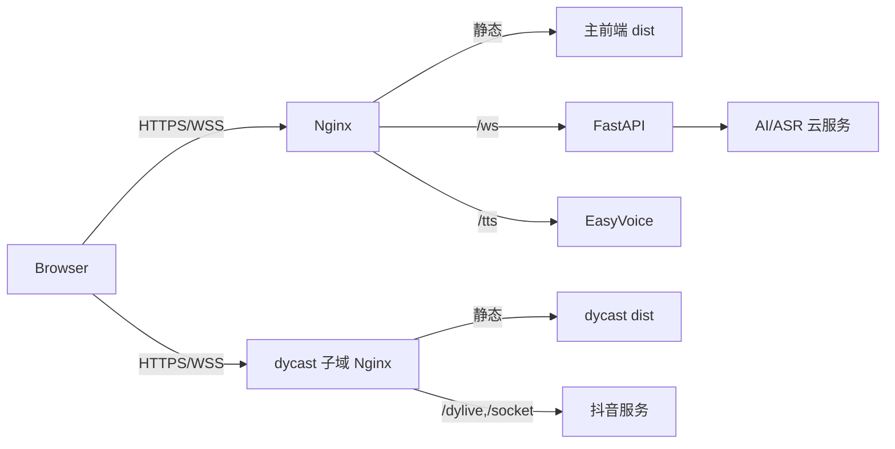

# 部署文档

## 1. 部署范围

本文覆盖：

- 本地源码开发；
- 本地生产构建；
- Docker Compose 部署；
- Nginx、WebSocket、TTS、dycast 配置；
- 上线验收和故障排查。

本文区分“当前仓库配置”和“建议生产配置”。当前配置存在已知缺口，不能不经检查直接用于公网生产。

## 2. 组件与端口

| 组件 | 默认端口 | Compose 服务 | 说明 |
| --- | --- | --- | --- |
| 统一入口 Nginx | 80、映射 443 | `nginx` | 当前只配置 HTTP 80 |
| React 前端 | 8080 | `frontend` | `vite preview` |
| FastAPI | 8000 | `backend` | HTTP + WebSocket |
| EasyVoice | 3000 | `tts` | TTS API 和音频文件服务 |
| dycast | 5173 | `dycast` | 当前容器运行 Vite dev server |

外部出站访问：

- OpenAI 兼容接口或智谱文本接口；
- 智谱视觉接口；
- SiliconFlow ASR；
- 抖音直播 HTTP/WebSocket 服务；
- npm/PyPI/Docker Registry（构建阶段）。

## 3. 环境要求

### 3.1 本地开发

- Node.js：建议 22+；Dockerfile 当前使用 23-alpine；
- npm；
- Python：Dockerfile 当前为 3.13；
- 现代 Chromium 浏览器；
- 摄像头/麦克风功能需要安全上下文：`localhost` 或 HTTPS。

### 3.2 Docker

- Docker Engine 20.10+；
- Docker Compose v2；
- 建议至少 4 CPU、6GB 内存、12GB 可用磁盘；
- 开放 80/443，调试时可开放 8000/3000/5173。

## 4. 环境变量

复制模板：

```bash
cp BackendProject/.env.example BackendProject/.env
chmod 600 BackendProject/.env
```

推荐配置：

```dotenv
# 文本模型：openai 或 zhipu
MODEL_TYPE=openai

# OpenAI 兼容文本接口
OPENAI_API_KEY=replace_me
OPENAI_BASE_URL=https://your-provider.example/v1
OPENAI_MODEL=your-model

# 智谱：图片分析必需；MODEL_TYPE=zhipu 时文字也使用
ZHIPUAI_API_KEY=replace_me

# SiliconFlow ASR
SILICONFLOW_API_KEY=replace_me

# 后端访问 TTS 的容器内地址
TTS_API_URL=http://tts:3000

# 浏览器访问音频文件的公开地址
# 本机可用 http://localhost:3000；生产建议走同域反代，如 https://example.com/tts
AUDIO_URL=http://localhost:3000

# 是否生成 TTS。当前代码按字符串真值判断，建议明确写 True 或留空。
ISAUDIO=True
```

注意：

- `TTS_API_URL` 与 `AUDIO_URL` 用途不同；
- `.env` 不得提交 Git、复制到镜像或打印到日志；
- 如果密钥曾出现在终端共享记录、CI 日志或聊天记录中，应立即轮换。

## 5. 本地开发部署

### 5.1 后端

```bash
cd BackendProject
python3 -m venv .venv
source .venv/bin/activate
pip install -r requirements.txt
cp .env.example .env
uvicorn main:app --host 0.0.0.0 --port 8000 --reload
```

验证：

```bash
curl http://localhost:8000/
curl http://localhost:8000/hello/test
```

### 5.2 TTS

```bash
docker run -d \
  --name cubism_tts \
  -p 3000:3000 \
  -v "$(pwd)/BackendProject/audio_files:/app/audio" \
  cosincox/easyvoice:latest
```

### 5.3 主前端

```bash
cd FrontendProject/TypeScript/AI
npm ci
npm run dev
```

构建脚本会把：

- `Core/` 复制到 `public/Core`；
- `FrontendProject/Resources/` 复制到 `public/Resources`。

### 5.4 dycast

```bash
cd dycast
npm ci
npm run dev
```

Vite 开发服务器已配置：

- `/dylive` → `https://live.douyin.com`；
- `/socket` → 抖音 WebSocket。

在 dycast 页面中，转发地址应填写浏览器可访问的后端地址，例如：

```text
ws://localhost:8000/ws/dycast_sender_001
```

直播展示页另行打开：

```text
http://localhost:8080/livestream
```

后端会把弹幕回复广播给该页面使用的 `livestream_user_*` 连接。

## 6. 本地构建与静态检查

```bash
# 后端语法
python3 -m compileall -q BackendProject

# 主前端
cd FrontendProject/TypeScript/AI
npm ci
npm run test
npm run build:prod

# dycast
cd ../../../dycast
npm ci
npm run type-check
npm run build-only

# Compose 解析
cd ..
docker compose config
```

已知非阻塞构建警告：

- `live2dcubismcore.js` 和 `mssdk.js` 是非 module script，Vite 不参与打包；
- 主前端产物主 JS 超过 500KB，建议后续分包；
- Compose 的 `version: "3.8"` 字段已过时，可删除。

## 7. Docker Compose

### 7.1 启动

```bash
docker compose up -d --build
docker compose ps
docker compose logs -f
```

### 7.2 停止与更新

```bash
docker compose down

git pull
git submodule update --init --recursive
docker compose up -d --build
```

### 7.3 当前卷

| 宿主机目录 | 容器目录 | 用途 |
| --- | --- | --- |
| `BackendProject/audio_files` | backend `/app/audio_files` | ASR 临时录音 |
| `BackendProject/audio_files` | tts `/app/audio` | TTS 生成音频 |
| `FrontendProject/Resources` | frontend `/app/Resources` | 运行时模型资源挂载 |
| `Core` | frontend `/app/Core` | Cubism Core 挂载 |

## 8. 当前 Compose/Nginx 已知问题

以下为代码审查发现的事实，部署前应处理。

### 8.1 前端 WebSocket 地址硬编码

`src/config.ts` 固定为：

```ts
WS_URL: 'ws://localhost:8000'
```

问题：

- 远程用户浏览器中的 `localhost` 指向用户自己的电脑；
- HTTPS 页面连接 `ws://` 会被浏览器拦截为混合内容。

建议改为同源动态地址：

```ts
const wsProtocol = location.protocol === 'https:' ? 'wss:' : 'ws:';
const wsBase = `${wsProtocol}//${location.host}`;
```

再连接 `${wsBase}/ws/${clientId}`。

### 8.2 Nginx 未代理 dycast

当前 `nginx/nginx.conf` 没有：

- `/dycast/` 静态或反向代理；
- `/dylive/` 抖音 HTTP 代理；
- `/socket/` 抖音 WebSocket 代理。

因此文档中所述 `http://host/dycast/` 在当前配置下不可用；只能直接访问 `http://host:5173/`，而生产环境仍需为 dycast 提供 `/dylive` 和 `/socket` 代理。

建议使用独立子域 `dycast.example.com`，减少子路径 base 配置复杂度；或完整配置以下三类 location。

### 8.3 443 未启用 TLS

Compose 映射了 `443:443`，但 Nginx 没有 `listen 443 ssl`，证书目录也未被使用。生产环境必须增加 TLS server 块及 80 → 443 跳转。

### 8.4 Nginx 静态卷未使用

Nginx 挂载主前端 `dist` 到 `/usr/share/nginx/html`，但 `/` 实际 `proxy_pass http://frontend:8080`，该静态卷冗余。可二选一：

- Nginx 直接服务 `dist`，删除 `frontend` 运行容器；
- 保留 `frontend` 容器，删除 Nginx 静态卷。

生产建议第一种。

### 8.5 前端 Docker 构建路径风险

前端源码在镜像中被复制到 `/app`，但 `vite.config.mts` 的 Framework alias 为 `../../../Framework/src`，按容器路径可能解析到 `/Framework/src`；Dockerfile 却复制到 `/app/Framework`。本地构建通过不代表镜像构建通过。

建议保持仓库目录结构进行构建，或把 alias 改为环境无关的绝对/相对配置。

### 8.6 dycast 使用开发服务器

dycast Dockerfile 最终仍运行：

```text
npm run dev
```

这不是推荐的生产部署方式。应使用 Nginx/Caddy 服务 `dist`，并显式配置 `/dylive` 和 `/socket` 反向代理。

### 8.7 音频公开地址

Compose 只设置了 `TTS_API_URL`，未设置 `AUDIO_URL`，后端默认返回 `http://localhost:3000...`。本机浏览器可能可用，远程和 HTTPS 场景不可用。

### 8.8 服务就绪

`depends_on` 只保证启动顺序，不保证服务已就绪。当前各服务没有 Compose healthcheck。

## 9. 建议生产拓扑



### 9.1 主站 Nginx 示例骨架

```nginx
server {
    listen 80;
    server_name example.com;
    return 301 https://$host$request_uri;
}

server {
    listen 443 ssl http2;
    server_name example.com;

    ssl_certificate     /etc/nginx/ssl/cert.pem;
    ssl_certificate_key /etc/nginx/ssl/key.pem;

    root /usr/share/nginx/html;
    index index.html;
    client_max_body_size 10m;

    location / {
        try_files $uri $uri/ /index.html;
    }

    location /ws/ {
        proxy_pass http://backend:8000;
        proxy_http_version 1.1;
        proxy_set_header Upgrade $http_upgrade;
        proxy_set_header Connection "upgrade";
        proxy_set_header Host $host;
        proxy_read_timeout 3600s;
        proxy_buffering off;
    }

    location /api/ {
        proxy_pass http://backend:8000/;
    }

    location /tts/ {
        proxy_pass http://tts:3000/;
    }
}
```

dycast 的 `/dylive` 和 `/socket` 代理应参考 `dycast/README.md`，尤其注意 Cookie、Origin、Host、User-Agent 和 WebSocket Upgrade。

## 10. 上线检查清单

### 10.1 配置

- [ ] 所有密钥通过 Secret 注入且已验证权限；
- [ ] `AUDIO_URL` 是浏览器可访问的 HTTPS 地址；
- [ ] 前端 WebSocket 使用同源 WSS；
- [ ] CORS 改为明确域名；
- [ ] Nginx 已配置 TLS；
- [ ] dycast 的 HTTP/WS 代理均可用。

### 10.2 功能验收

- [ ] `/`、`/mobile`、`/livestream` 刷新不 404；
- [ ] 文字请求能显示回复和动作；
- [ ] 开启语音后音频可播放且口型同步；
- [ ] 摄像头主动拍照和自动拍照可用；
- [ ] 移动端录音可被识别；
- [ ] dycast 可连接直播间并转发；
- [ ] 欢迎、关注、点赞和评论回复可到达直播页。

### 10.3 运维

- [ ] 配置容器健康检查；
- [ ] 配置日志轮转；
- [ ] 限制音频目录大小并设置清理任务；
- [ ] 监控后端连接数、LLM/TTS/ASR 延迟和错误率；
- [ ] 配置备份和回滚版本；
- [ ] 不直接暴露 8000/3000/5173 到公网。

## 11. 故障排查

### 11.1 页面可开但 WebSocket 失败

```bash
docker compose logs -f nginx backend
```

检查：

- 浏览器实际连接地址是否仍为 `localhost`；
- HTTPS 页面是否使用 `wss://`；
- Nginx `/ws/` 是否保留 Upgrade/Connection；
- 防火墙和代理空闲超时。

### 11.2 有文字无语音

```bash
docker compose logs -f backend tts
```

检查：

- `ISAUDIO`；
- `TTS_API_URL` 容器内连通性；
- `AUDIO_URL` 浏览器可达性；
- 浏览器自动播放策略和 CORS；
- TTS 返回路径是否与挂载目录一致。

### 11.3 语音识别失败

- 检查 `SILICONFLOW_API_KEY`；
- 检查 `audio_files` 是否生成文件；
- 用 `file`/`ffprobe` 核实真实编码；
- 当前浏览器发送 WebM/Opus，不要仅依据 `.wav` 后缀判断格式。

### 11.4 图片识别失败

- 检查 `ZHIPUAI_API_KEY`；
- 检查浏览器摄像头权限和 HTTPS；
- 检查 WebSocket 消息大小限制；
- 后端日志确认 Pillow 校验和视觉模型错误。

### 11.5 dycast 页面可开但无法采集

- 开发环境确认 Vite 的 `/dylive`、`/socket` proxy 生效；
- 生产环境确认 Nginx Cookie、Host、Origin、UA 和 Upgrade 配置；
- 检查抖音直播间是否开播；
- 第三方私有协议可能变化，需要同步更新 dycast。

## 12. 回滚

建议以不可变镜像标签部署：

```bash
docker compose pull
docker compose up -d
```

出现故障时：

1. 恢复上一版本镜像标签；
2. `docker compose up -d`；
3. 验证健康检查、WebSocket 和文字对话；
4. 再逐项开启 TTS、ASR、图片和直播链路。
