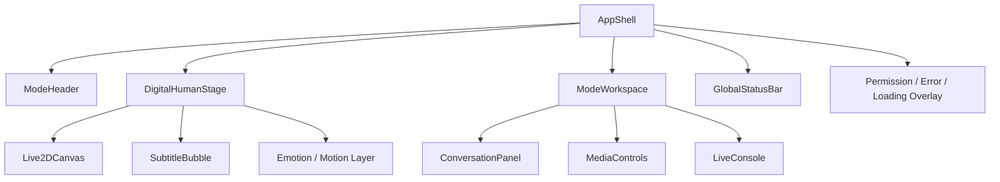
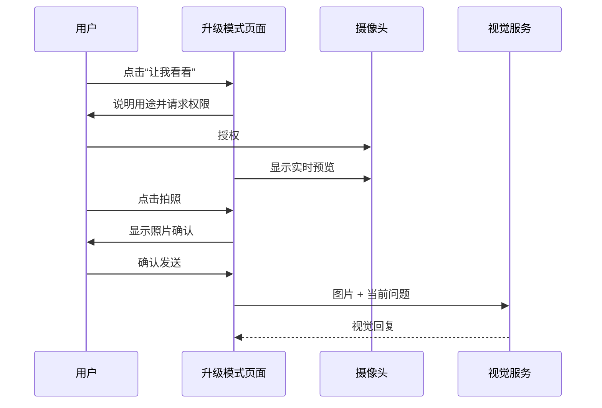
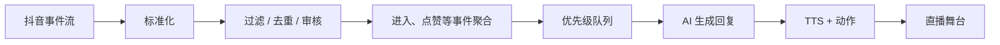
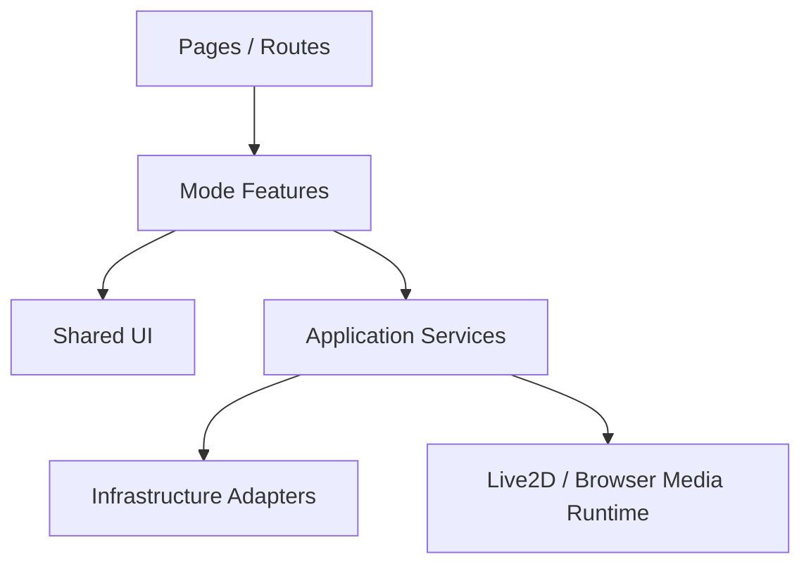
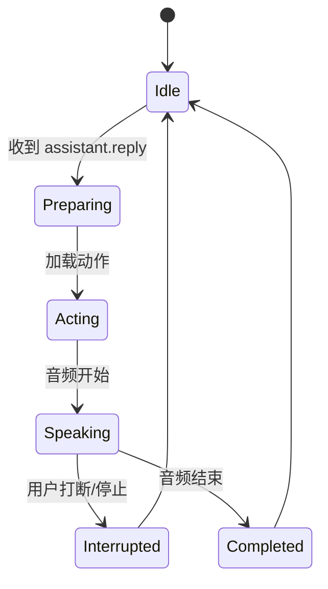

# AI 女友前端重构设计

> 规划基线：2026-08-14。本文按三种模式规划：普通模式、升级模式、抖音直播模式。

## 1. 重构目标

现有前端已经具备聊天、语音录制、摄像头、Live2D、手势和直播展示能力，但这些能力分散在 `WebSocketPanel`、`MobilePage`、`LiveStreamPage` 和多个 Live2D 单例中。

本次重构目标不是再增加三个互相独立的页面，而是建立：

> **一个统一的 AI 女友数字人内核 + 三种能力模式 + 两类直播界面。**

核心目标：

1. 三种模式共享同一个 Live2D、对话、音频播放和 WebSocket 基础设施。
2. 模式只决定“开放哪些能力”和“采用什么页面布局”，不复制底层代码。
3. 普通模式保持简单，首次进入即可聊天。
4. 升级模式集中管理麦克风、摄像头和持续聆听权限。
5. 直播模式将“运营控制台”和“OBS 展示画面”分离。
6. 为后续账号、会员、角色切换、长期记忆和更多直播平台预留扩展点。

## 2. 产品模式定义

### 2.1 能力矩阵

| 能力 | 普通模式 | 升级模式 | 抖音直播模式 |
| --- | --- | --- | --- |
| 文字聊天 | 支持 | 支持 | 支持运营者手动输入 |
| AI 文字回复 | 支持 | 支持 | 支持 |
| TTS 语音播放 | 支持 | 支持 | 支持 |
| Live2D 口型同步 | 支持 | 支持 | 支持 |
| 回答时播放动作 | 支持 | 支持 | 支持 |
| 用户语音输入 | 不开放 | 支持 | 可选，供主播插话 |
| 摄像头视觉 | 不开放 | 支持 | 可选，默认关闭 |
| 持续聆听 | 不开放 | 支持 | 可选，默认关闭 |
| 抖音评论接入 | 不开放 | 不开放 | 支持 |
| 进入/关注/点赞互动 | 不开放 | 不开放 | 支持 |
| 评论队列与节流 | 不开放 | 不开放 | 支持 |
| OBS 纯净输出 | 不开放 | 不开放 | 支持 |

### 2.2 普通模式

定位：低门槛、低干扰的日常陪伴。

用户可以：

- 输入文字；
- 查看 AI 女友回复；
- 听到 TTS 语音；
- 看到口型同步；
- 看到与回答情绪匹配的 Live2D 动作；
- 切换角色、声音和背景等基础展示配置。

普通模式不申请麦克风和摄像头权限，避免用户首次进入时产生隐私压力。

### 2.3 升级模式

定位：更沉浸的多模态陪伴。

包含三类输入能力：

#### 语音

- 按住说话；
- 点击开始/结束录音；
- 语音转文字；
- 可在发送前确认识别文本；
- AI 回复继续通过 TTS 和口型同步播放。

#### 视觉

- 用户主动让 AI “看看我”；
- 单次拍照；
- 用户确认后发送；
- 自动拍照必须再次得到用户授权；
- 页面明确显示摄像头开启状态。

#### 听觉

“听觉”与普通语音输入应区分：

- **语音输入**：用户明确点击后说话，完成一次对话。
- **持续聆听**：在用户授权的会话中监听语音活动或环境事件。

升级模式可规划以下听觉状态：

```text
关闭 -> 等待唤醒 -> 正在聆听 -> 正在理解 -> AI 回答 -> 等待唤醒
```

第一阶段可以只实现语音活动检测和连续对话；环境声音识别，例如笑声、哭声、音乐、敲门声，需要新增后端听觉模型能力，当前项目尚未实现。

### 2.4 抖音直播模式

定位：AI 女友作为虚拟主播自动参与直播间互动。

输入来源：

- 抖音聊天评论；
- 用户进入直播间；
- 关注；
- 点赞；
- 礼物；
- 主播手动输入或插话。

输出：

- AI 回复文本；
- TTS 音频；
- Live2D 口型；
- 情绪动作；
- 字幕气泡；
- 可选感谢、欢迎和礼物动作。

直播模式必须具备：

- 评论队列；
- 消息类型过滤；
- 高频事件聚合；
- 回复节流；
- 正在回答时的排队策略；
- 敏感内容过滤；
- 手动暂停自动回复；
- 紧急静音；
- OBS 纯净输出。

## 3. 整体信息架构

### 3.1 路由规划

| 路由 | 页面 | 说明 |
| --- | --- | --- |
| `/` | 模式选择页 | 进入三种模式 |
| `/chat` | 普通模式 | 文字聊天与数字人展示 |
| `/advanced` | 升级模式 | 语音、视觉、听觉 |
| `/live/console` | 直播控制台 | 评论、队列、连接、策略和人工控制 |
| `/live/stage` | 直播舞台 | OBS/录屏使用的纯净数字人画面 |
| `/settings` | 设置中心 | 模型、声音、连接、隐私和显示 |

保留兼容跳转：

| 旧路由 | 新路由 |
| --- | --- |
| `/mobile` | `/advanced` |
| `/livestream` | `/live/stage` |

### 3.2 模式选择页

```text
┌─────────────────────────────────────────────────────┐
│                     小凡 AI 女友                    │
│            今天想用哪种方式和我相处呢？             │
│                                                     │
│  ┌────────────┐  ┌────────────┐  ┌────────────┐   │
│  │ 普通模式   │  │ 升级模式   │  │ 抖音直播   │   │
│  │ 轻松聊天   │  │ 看见与听见 │  │ 虚拟主播   │   │
│  │ 无权限申请 │  │ 多模态互动 │  │ 评论自动答 │   │
│  └────────────┘  └────────────┘  └────────────┘   │
│                                                     │
│  最近对话                              设置 ⚙       │
└─────────────────────────────────────────────────────┘
```

设计原则：

- 不在首页堆叠开发调试按钮；
- 清楚说明每种模式会使用的权限；
- 升级模式和直播模式首次进入时展示能力说明；
- 上次使用模式可以作为快捷入口，但不能自动开启摄像头或麦克风。

## 4. 统一页面外壳

三种模式共享 `AppShell`：



### 4.1 AppShell

负责：

- 当前模式；
- 页面主布局；
- 连接状态；
- 全局设置入口；
- 模式切换确认；
- 权限提示；
- 全局错误提示；
- 移动端安全区域适配。

### 4.2 DigitalHumanStage

三种模式唯一共享的数字人舞台：

- Live2D Canvas；
- 当前角色；
- 背景；
- 字幕；
- 动作状态；
- 口型状态；
- AI 思考状态；
- 麦克风/摄像头隐私状态；
- 直播模式透明背景。

不允许每个页面自行访问：

```ts
LAppDelegate.getInstance()._subdelegates.at(0)
```

应统一封装为：

```ts
interface AvatarController {
  playMotion(motion: AvatarMotion): void;
  playReplyAudio(url: string): Promise<void>;
  stopAudio(): void;
  setModel(modelId: string): Promise<void>;
  setExpression(expression: AvatarExpression): void;
  setLipSyncLevel(level: number): void;
}
```

### 4.3 ConversationPanel

统一负责：

- 消息列表；
- 文本输入；
- 发送状态；
- AI 正在输入；
- 失败重试；
- 回复音频重播；
- 图片、语音和直播来源标记；
- 会话清空；
- 消息时间和状态。

模式通过能力配置决定哪些按钮可见，不再创建三套聊天组件。

## 5. 普通模式设计

### 5.1 桌面布局

```text
┌────────────────────────────────────────────────────────────┐
│ 小凡 · 普通模式       在线     切换模式        设置 ⚙      │
├───────────────────────────────┬────────────────────────────┤
│                               │  今天过得怎么样？           │
│                               │                            │
│          Live2D 小凡          │  小凡：我一直在这里呀～     │
│                               │  [重播语音]                 │
│       字幕 / 当前回复         │                            │
│                               │                            │
│                               ├────────────────────────────┤
│                               │ 输入消息……           发送 │
└───────────────────────────────┴────────────────────────────┘
```

### 5.2 移动端布局

```text
┌──────────────────────┐
│ 小凡 · 普通模式   ⚙ │
├──────────────────────┤
│                      │
│      Live2D 小凡     │
│                      │
│   当前回复字幕气泡   │
├──────────────────────┤
│ 历史消息抽屉         │
├──────────────────────┤
│ 输入消息……     发送 │
└──────────────────────┘
```

移动端默认突出数字人，聊天历史通过半屏抽屉展开。

### 5.3 回答状态

```text
idle
  -> sending
  -> thinking
  -> speaking
  -> idle
```

对应 UI：

- `sending`：用户消息显示发送中；
- `thinking`：角色显示轻微等待动画；
- `speaking`：播放 TTS、口型和回答动作；
- TTS 失败：仍显示文字和动作，不阻断回复。

## 6. 升级模式设计

### 6.1 桌面布局

```text
┌─────────────────────────────────────────────────────────────┐
│ 小凡 · 升级模式   🎤麦克风  📷摄像头  👂聆听中   设置 ⚙    │
├───────────────────────────────┬─────────────────────────────┤
│                               │ 对话                        │
│          Live2D 小凡          │                             │
│                               │ 小凡：你今天看起来有点累呀 │
│   ┌───────────────────────┐   │                             │
│   │ 可选摄像头预览        │   ├─────────────────────────────┤
│   │ 拍照前确认            │   │ [按住说话] [让我看看]      │
│   └───────────────────────┘   │ [持续聆听 开/关]           │
│                               │ 输入消息……           发送  │
└───────────────────────────────┴─────────────────────────────┘
```

### 6.2 能力控制条

升级模式顶部固定显示：

| 状态 | 表现 |
| --- | --- |
| 麦克风关闭 | 灰色图标 |
| 正在录音 | 红色脉冲图标和计时 |
| 摄像头开启 | 绿色状态点和预览 |
| 持续聆听 | 明显的波形和“正在聆听”文字 |
| AI 正在回答 | 禁止重复触发或允许打断，取决于设置 |

权限开启必须由用户点击触发，不在页面加载时自动申请。

### 6.3 视觉交互

主动视觉流程：



后端自动判断“需要拍照”时，前端不应直接无提示拍照。改为：

```text
小凡想看看你现在的样子，是否打开摄像头？
[允许一次] [这次不要]
```

### 6.4 持续聆听

建议提供三个级别：

| 级别 | 行为 |
| --- | --- |
| 关闭 | 不访问麦克风 |
| 连续对话 | 使用 VAD 判断用户何时开始/结束说话 |
| 环境感知 | 识别环境声音事件，需要后端新能力 |

任何持续聆听状态下都应：

- 显示固定隐私指示；
- 提供一键停止；
- 页面离开时立即关闭媒体轨道；
- 不在用户不知情时保存原始音频；
- 明确当前音频是否正在上传。

### 6.5 AI 回答打断

升级模式应支持：

- 用户点击停止，终止当前 TTS；
- 用户开始说话时，可选自动打断 AI；
- 打断后停止口型和当前动作；
- 新语音作为下一条用户消息。

## 7. 抖音直播模式设计

直播模式拆为“控制台”和“舞台”，不能继续只提供一个简单直播页面。

### 7.1 直播控制台

```text
┌──────────────────────────────────────────────────────────────────────┐
│ 抖音直播控制台  房间：已连接  转发：已连接  AI：在线   开始/暂停   │
├─────────────────┬──────────────────────────┬─────────────────────────┤
│ 直播间状态      │ 实时评论                 │ AI 回复队列             │
│ 在线人数        │ 小明：你好呀             │ 1. 欢迎小明             │
│ 点赞数          │ 小红：唱首歌吧           │ 2. 回答小红             │
│ 关注数          │ [聊天][进入][关注][礼物] │                         │
│                 │                          │ [跳过] [置顶] [立即答]  │
├─────────────────┴──────────────────────────┴─────────────────────────┤
│ 自动回复：开  欢迎：开  关注：开  点赞聚合：30秒  敏感过滤：开     │
│ 主播手动输入……                                  [插播回答]          │
└──────────────────────────────────────────────────────────────────────┘
```

### 7.2 直播舞台

供 OBS 浏览器源使用：

```text
┌────────────────────────────────────────────┐
│                                            │
│                 Live2D 小凡               │
│                                            │
│                                            │
│        小凡：欢迎大家来到直播间～          │
│                                            │
└────────────────────────────────────────────┘
```

特点：

- 可配置透明背景；
- 无返回按钮、输入框和调试控件；
- 固定画布比例；
- 字幕安全区；
- 网络断开时可选择隐藏错误或显示离线提示；
- URL 参数控制背景、字幕和分辨率。

示例：

```text
/live/stage?transparent=1&subtitle=1&resolution=1920x1080
```

### 7.3 评论队列

不要每收到一条评论就立即调用 AI。

建议流程：



建议优先级：

| 优先级 | 消息 |
| --- | --- |
| P0 | 主播手动插播、紧急通知 |
| P1 | 礼物、付费互动 |
| P2 | 明确提问和点名评论 |
| P3 | 普通聊天评论 |
| P4 | 进入、关注、点赞聚合 |

### 7.4 事件聚合

| 事件 | 策略 |
| --- | --- |
| 进入直播间 | 5～10 秒窗口聚合欢迎 |
| 关注 | 逐个或小批量感谢 |
| 点赞 | 按时间窗口和用户名去重 |
| 礼物 | 根据礼物价值和连击结束状态响应 |
| 评论 | 选取有意义的问题，不保证逐条回复 |

### 7.5 安全控制

控制台必须提供：

- 暂停自动回复；
- 停止当前语音；
- 清空待回答队列；
- 屏蔽用户；
- 屏蔽关键词；
- 仅允许指定事件类型；
- 手动审核模式；
- 一键关闭直播互动。

## 8. 前端技术架构

### 8.1 分层



### 8.2 建议目录

```text
src/
├── app/
│   ├── App.tsx
│   ├── routes.tsx
│   ├── AppShell.tsx
│   └── providers/
├── modes/
│   ├── mode.types.ts
│   ├── mode.registry.ts
│   ├── basic/
│   │   └── BasicChatPage.tsx
│   ├── advanced/
│   │   ├── AdvancedPage.tsx
│   │   ├── VoiceControl.tsx
│   │   ├── VisionControl.tsx
│   │   └── HearingControl.tsx
│   └── live/
│       ├── LiveConsolePage.tsx
│       ├── LiveStagePage.tsx
│       ├── CommentFeed.tsx
│       ├── ReplyQueue.tsx
│       └── LivePolicyPanel.tsx
├── features/
│   ├── conversation/
│   ├── avatar/
│   ├── speech/
│   ├── vision/
│   ├── hearing/
│   ├── livestream/
│   └── settings/
├── shared/
│   ├── components/
│   ├── hooks/
│   ├── types/
│   └── utils/
├── services/
│   ├── conversation.service.ts
│   ├── avatar.service.ts
│   ├── media.service.ts
│   ├── livestream.service.ts
│   └── websocket.transport.ts
└── live2d/
    └── 现有 lapp*.ts
```

### 8.3 模式注册

```ts
type AppMode = 'basic' | 'advanced' | 'douyin-live';

interface ModeCapabilities {
  textInput: boolean;
  ttsOutput: boolean;
  lipSync: boolean;
  replyMotion: boolean;
  speechInput: boolean;
  visionInput: boolean;
  continuousHearing: boolean;
  livestreamInput: boolean;
  obsStage: boolean;
}

interface ModeDefinition {
  id: AppMode;
  title: string;
  route: string;
  capabilities: ModeCapabilities;
}
```

页面和组件只查询能力，不使用大量：

```ts
if (mode === 'advanced') ...
```

### 8.4 状态域

不再让一个 `WebSocketManager` 同时保存连接、UI 消息和页面回调。

建议划分：

| 状态域 | 内容 |
| --- | --- |
| `session` | session id、client id、当前模式、连接状态 |
| `conversation` | 消息、发送状态、当前回复 |
| `avatar` | 模型、动作、表情、口型、说话状态 |
| `audio` | TTS 队列、当前播放、音量、打断 |
| `media` | 麦克风、摄像头、权限、录制状态 |
| `hearing` | VAD、持续聆听状态、音频上传状态 |
| `livestream` | 房间、连接、事件流、回复队列、策略 |
| `settings` | 声音、角色、背景、字幕和隐私设置 |

初期可使用 React Context + `useReducer` 实现，各状态域提供独立 Context，避免所有状态更新导致整页重渲染。

### 8.5 服务接口

```ts
interface ConversationService {
  sendText(input: TextInput): Promise<void>;
  sendImage(input: ImageInput): Promise<void>;
  sendAudio(input: AudioInput): Promise<void>;
  cancelReply(replyId: string): Promise<void>;
}

interface MediaService {
  requestMicrophone(): Promise<MediaStream>;
  requestCamera(): Promise<MediaStream>;
  capturePhoto(): Promise<Blob>;
  stopAll(): void;
}

interface LivestreamService {
  connectRoom(roomId: string): Promise<void>;
  pauseAutoReply(): void;
  resumeAutoReply(): void;
  skipReply(replyId: string): void;
}
```

## 9. 前后端交互调整

### 9.1 会话初始化

前端连接后应声明模式和能力：

```json
{
  "version": "1.0",
  "type": "session.start",
  "data": {
    "mode": "advanced",
    "client_role": "user",
    "capabilities": [
      "text",
      "speech",
      "vision",
      "hearing",
      "tts",
      "lip_sync"
    ]
  }
}
```

### 9.2 AI 回复

建议后端一次返回结构化回答，减少前端猜测：

```json
{
  "version": "1.0",
  "type": "assistant.reply",
  "data": {
    "reply_id": "reply-001",
    "text": "今天看起来有点累，要不要先休息一下？",
    "audio_url": "/tts/audio/001.mp3",
    "emotion": "concerned",
    "motion": {
      "group": "TapBody",
      "index": 2
    },
    "vision_request": null
  }
}
```

前端按统一顺序执行：

```text
显示文字 -> 播放动作 -> 播放音频 -> 口型同步 -> 恢复待机
```

### 9.3 视觉请求

后端不应直接命令拍照，而应请求权限：

```json
{
  "type": "assistant.capability_request",
  "data": {
    "capability": "camera.capture",
    "reason": "用户希望 AI 看看当前气色",
    "single_use": true
  }
}
```

用户同意后前端再发送图片。

### 9.4 直播事件

直播事件统一为：

```json
{
  "type": "livestream.event",
  "data": {
    "platform": "douyin",
    "room_id": "room-001",
    "event_id": "event-001",
    "event_type": "comment",
    "user": {
      "id": "user-001",
      "name": "小明"
    },
    "content": "你好呀",
    "timestamp": "2026-08-14T06:00:00Z"
  }
}
```

直播控制台接收处理状态：

```json
{
  "type": "livestream.queue.updated",
  "data": {
    "pending": 12,
    "current_reply": "event-001",
    "auto_reply_enabled": true
  }
}
```

## 10. 音频与动作编排

所有模式共享 `ReplyOrchestrator`：



编排规则：

1. 新回复进入队列；
2. 预加载音频；
3. 动作先启动或与音频同时启动；
4. 音频 RMS 驱动口型；
5. 音频结束后恢复待机；
6. 用户打断时停止音频、口型和当前动作；
7. 直播模式按队列顺序播放，普通/升级模式通常只保留最新回复。

## 11. 响应式设计

### 11.1 断点原则

- 宽屏：数字人和对话左右分栏；
- 平板：数字人为主，对话面板可收起；
- 手机：数字人上方、输入底部固定、历史消息抽屉；
- 直播舞台：不使用普通响应式布局，按 OBS 固定比例渲染。

### 11.2 触控

- 主要按钮点击区域不小于 44px；
- 录音使用“点击切换”与“按住说话”两种可配置方式；
- 摄像头关闭按钮始终可见；
- 不依赖 hover 完成关键操作。

## 12. 隐私与权限设计

### 12.1 权限原则

- 普通模式不申请任何媒体权限；
- 麦克风和摄像头按能力分别授权；
- 自动拍照不能绕过用户确认；
- 持续聆听必须有持续可见指示；
- 切换出升级模式时停止媒体流；
- 刷新页面后不自动恢复持续聆听；
- 明确哪些数据上传到后端、哪些只在浏览器处理。

### 12.2 权限面板

```text
隐私与设备

麦克风          已允许   [关闭]
摄像头          本次允许 [关闭]
持续聆听        已关闭   [开启]
保存原始录音    否
保存照片        否
```

## 13. 错误与降级

| 故障 | 前端降级 |
| --- | --- |
| WebSocket 断开 | 显示重连状态，禁止发送，不关闭已有文字 |
| TTS 失败 | 只展示文字和动作 |
| 动作失败 | 继续文字和语音，恢复待机 |
| ASR 失败 | 保留录音失败提示，允许重试或文字输入 |
| 摄像头拒绝 | 回到文字/语音，不重复弹权限 |
| 视觉模型失败 | 提示“暂时看不清”，不影响聊天 |
| dycast 断开 | 暂停自动回复，舞台保持角色待机 |
| 评论过载 | 聚合、丢弃低优先级事件并显示统计 |

## 14. 从现有代码迁移

### 14.1 现有组件去向

| 现有文件 | 重构后 |
| --- | --- |
| `WebSocketPanel.tsx` | 拆为 ConversationPanel、TextComposer、VisionCapture、VoiceRecorder |
| `MobilePage.tsx` | 不再单独维护业务逻辑，由 `/advanced` 响应式布局替代 |
| `LiveStreamPage.tsx` | 演进为 `/live/stage` |
| `websocketmanager.ts` | 拆为纯 Transport + Session/Conversation 状态 |
| `lappaudiomanager.ts` | 保留底层能力，由 AvatarAudioService 包装 |
| `lapplive2dmanager.ts` | 保留底层能力，由 AvatarController 包装 |
| `HandGestureControls.tsx` | 作为升级模式可选能力，不放在普通模式主界面 |
| `AudioControls.tsx` | 转为设置/调试功能，普通用户不直接看到 |

### 14.2 分阶段实施

#### 第一阶段：统一内核

- 创建 `AppShell` 和 `DigitalHumanStage`；
- 封装 `AvatarController`；
- 拆分 WebSocket 传输与 UI 消息；
- 建立统一 ConversationPanel；
- 保持后端旧协议兼容。

#### 第二阶段：普通模式

- 上线 `/chat`；
- 只保留文字输入；
- 完成 TTS、口型和动作编排；
- 完成桌面与移动端布局。

#### 第三阶段：升级模式

- 迁移现有录音和拍照；
- 增加权限管理；
- 增加图片确认；
- 增加回答打断；
- 再实现 VAD 连续对话；
- 环境声音识别单独立项。

#### 第四阶段：直播模式

- 将舞台和控制台分离；
- 接入标准化直播事件；
- 增加评论队列、优先级、聚合和手动控制；
- 为 OBS 提供透明舞台。

#### 第五阶段：协议升级

- 引入版本、请求 ID、session id；
- 使用结构化动作和情绪；
- 将视觉请求改为能力授权请求；
- 为直播队列增加状态事件。

## 15. 验收标准

### 15.1 普通模式

- 用户无需授权设备即可进入；
- 能发送文字并收到 AI 回复；
- 回复语音、口型和动作同步；
- TTS 失败不影响文字回复；
- 桌面和手机均可正常使用。

### 15.2 升级模式

- 麦克风和摄像头只在点击后申请；
- 支持语音输入、识别确认和发送；
- 支持拍照预览、确认和视觉回答；
- 持续聆听有明确状态和一键停止；
- 用户可以打断 AI 语音；
- 离开页面后媒体轨道全部关闭。

### 15.3 抖音直播模式

- 控制台能显示连接状态和评论流；
- 直播事件经过过滤、聚合和队列；
- 能暂停、恢复、跳过和手动插播；
- 舞台页无控制 UI，可供 OBS 使用；
- 回答时文字、语音、动作和口型一致；
- dycast 断开时不会继续生成错误回复。

## 16. 最终设计结论

本次前端重构应围绕以下结构展开：

```text
AI 女友应用
├── 统一数字人舞台
├── 统一对话系统
├── 统一音频与动作编排
├── 普通模式：文字聊天
├── 升级模式：语音 + 视觉 + 听觉
└── 抖音直播模式
    ├── 直播控制台
    └── OBS 直播舞台
```

这样既能保留现有 Live2D、语音、图片和直播能力，又能避免继续在多个页面中复制 WebSocket、录音、播放和模型控制逻辑。

## 17. 当前实施状态

> 更新日期：2026-08-15。

### 17.1 已完成

- 已交付 `/`、`/chat`、`/advanced`、`/live/console`、`/live/stage` 和 `/settings`。
- 已保留 `/mobile` 到 `/advanced`、`/livestream` 到 `/live/stage` 的兼容跳转。
- 已建立模式注册、统一页面外壳、统一数字人舞台和统一会话 Hook。
- 普通模式已支持文字聊天、TTS 播放、口型同步和回复动作。
- 升级模式已支持 WebM/Opus 语音录制、摄像头拍照预览确认，以及后端视觉请求的再次授权。
- 升级模式已提供本地环境音量监测，并在界面中明确隐私状态。
- 直播模式已拆分为运营控制台和 OBS 纯净舞台。
- 直播控制台已支持事件流、自动回复开关、事件策略开关、人工插播和 dycast 外部入口。
- 后端已支持直播事件批次广播及直播策略控制，并兼容直播舞台和控制台同时接收回复。
- WebSocket 已支持多订阅者、自动重连、主动断开和结构化直播事件。
- 普通文字聊天已支持大模型增量文字输出。
- TTS 已按完整句子切分，并通过 EasyVoice 流式接口预加载和顺序播放。
- 流式音频播放期间继续使用 Web Audio Analyser 驱动 Live2D 口型。
- 用户发送新消息或点击停止时会清空上一条回复的待播放语音队列。

### 17.2 当前边界

- “听觉”目前只监测本地环境音量，不理解哭声、笑声、音乐、敲门声等语义；这需要新增后端听觉识别模型。
- 直播消息当前仍是单进程内存中的即时批处理，尚未实现 Redis/数据库持久化队列、优先级调度和跨实例一致性。
- `livestream_clear_queue` 当前返回兼容响应，但没有持久化队列可清理。
- 抖音自动评论回复仍沿用完整文本和完整音频流程；流式链路当前用于普通、升级及主播手动聊天。
- 高频事件聚合、礼物优先级、敏感内容过滤和完整回复节流仍属于下一阶段。
- 当前前端录音上传格式为浏览器实际产生的 WebM/Opus；部署前应确认所选 ASR 服务支持该格式。

### 17.3 验证结果

- TypeScript 类型检查通过。
- 前端生产构建通过。
- Python 后端编译检查通过。
- 后端 WebSocket 冒烟测试通过，覆盖直播自动回复开关、事件批次广播、策略更新和清理队列兼容响应。
