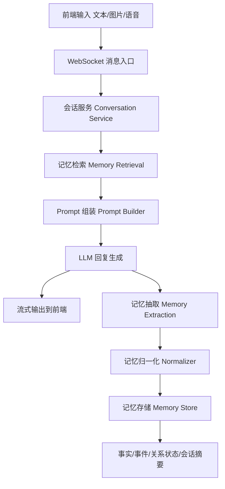
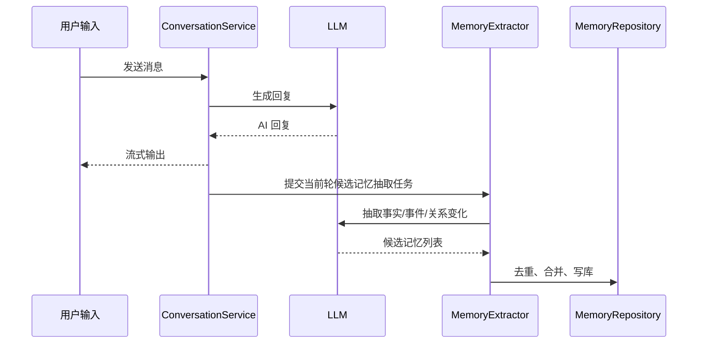

# 虚拟人物记忆系统设计文档

## 1. 文档目标

本文面向当前仓库，为“小凡 AI”设计一套可演进的虚拟伴侣记忆系统。目标不是先做一个学术化的“全知记忆引擎”，而是在现有 FastAPI + WebSocket + Live2D 架构上，落地一套能明显提升陪伴感、连续性和角色一致性的工程方案。

本文覆盖：

- 当前实现的记忆现状与问题；
- 面向虚拟伴侣场景的记忆分层设计；
- 数据模型、写入流程、检索流程和 Prompt 组装策略；
- 前后端协议扩展建议；
- 隐私、安全、纠错和遗忘机制；
- 分阶段上线方案与验收标准。

本文不覆盖：

- 具体数据库迁移脚本；
- 前端完整 UI 视觉稿；
- 第三方向量数据库或图数据库的选型细节实现。

## 2. 背景与现状

### 2.1 当前项目中的“记忆”现状

当前系统已经具备“多轮对话上下文”，但还不具备“长期记忆系统”。

现状如下：

- 后端 `ConnectionManager.message_history` 按 `client_id` 在进程内保存消息历史；
- 文本回复时，直接把历史消息拼接到当前 LLM 输入中；
- 图片分析结果会追加到当前客户端历史；
- 前端只持久化角色名和性格设定，不持久化用户身份、会话身份或长期记忆；
- 页面会生成新的随机 `client_id`，跨页面、跨天、跨设备无法自然延续关系。

这意味着当前系统更接近“带上下文的聊天”，而不是“会长期记得你”的虚拟伴侣。

### 2.2 当前痛点

1. **没有跨会话记忆**
   页面刷新或重新进入后，系统无法稳定识别“还是同一个用户”。

2. **消息历史不是长期记忆**
   直接堆聊天记录会带来 token 成本增加、检索不准、容易遗忘早期重要信息。

3. **没有记忆类型区分**
   “你喜欢奶茶”和“上周你因为加班崩溃”在系统里都只是普通聊天文本，无法区分优先级。

4. **没有手动控制能力**
   用户不能明确要求“这件事请记住”，也不能纠正、删除错误记忆。

5. **没有关系状态层**
   陪伴产品最重要的不是只记住事实，而是能记住彼此最近的关系进展、情绪背景和承诺事项。

6. **没有遗忘与降级机制**
   所有内容理论上都可能无限累计，但没有 TTL、覆盖、归档和摘要策略。

## 3. 设计原则

### 3.1 业务原则

- 记忆服务于“陪伴感”，不是单纯提高召回率；
- 优先支持“自然提起”和“持续关心”，而不是频繁背诵事实；
- 用户必须能理解、编辑和删除关键记忆；
- 错记比忘记更伤体验，因此系统必须支持低置信度、待确认和纠错流程；
- 角色记忆与用户身份要解耦，支持后续多角色扩展。

### 3.2 工程原则

- 尽量复用现有 WebSocket 对话主链，不重写聊天主流程；
- 第一版避免引入重型图数据库；
- 结构化存储优先，向量检索作为增强层而不是唯一层；
- 记忆写入和回复生成解耦，优先异步化；
- 设计上兼容单机开发与后续多实例部署。

## 4. 设计目标

### 4.1 核心目标

1. 让系统可以跨会话识别同一用户。
2. 让系统可以自动提取、存储和检索长期记忆。
3. 让用户可以手动置顶、编辑和删除关键记忆。
4. 让虚拟人物能够维持关系连续性和情绪连贯性。
5. 让记忆系统在文字、图片、语音场景下行为一致。

### 4.2 非目标

- 第一阶段不做“自动生成完整关系图可视化 UI”；
- 第一阶段不做“无限历史全量回放”；
- 第一阶段不接入 Neo4j 一类专门图库；
- 第一阶段不做复杂的代理式任务记忆。

## 5. 记忆分层模型

本系统采用五层记忆模型。

### 5.1 L0 工作记忆

定义：当前回复直接可见的近场上下文。

内容：

- 最近 10 到 30 轮原始对话；
- 当前模式上下文，如普通聊天、高级视觉、直播；
- 当前输入附带的图片、语音转文本结果；
- 当前回合临时状态，如是否刚拍照、是否刚完成 ASR。

作用：

- 保证当前对话流畅；
- 覆盖短期跟进和追问；
- 不承担长期记忆职责。

### 5.2 L1 会话摘要记忆

定义：对单次聊天阶段性内容的压缩摘要。

内容：

- 本次会话核心话题；
- 重要情绪变化；
- 尚未完成的话题；
- 暂时性上下文。

作用：

- 替代超长原始聊天历史；
- 降低 token 消耗；
- 为恢复上下文提供中层支撑。

### 5.3 L2 事实记忆

定义：关于用户、角色和双方世界状态的稳定事实。

典型内容：

- 用户昵称、职业、学校、宠物、家人称呼；
- 偏好：喜欢的饮料、颜色、音乐、电影；
- 禁忌：不喜欢被怎么称呼、不想聊的话题；
- 角色共同设定：称呼、互动边界、语言风格。

特点：

- 强结构化；
- 可被新事实覆盖；
- 可由用户手动编辑。

### 5.4 L3 事件记忆

定义：双方共同经历过、值得回忆的具体事件。

典型内容：

- “前天你考试很紧张，我陪你复习到很晚”；
- “你昨天发来一张自拍，我夸你今天气色好一些”；
- “我们约好周末一起看电影”；
- “你上次说被领导批评后很难过”。

特点：

- 时间性强；
- 情绪价值高；
- 比单纯事实更能提升陪伴感。

### 5.5 L4 关系状态记忆

定义：当前这段关系的高层摘要。

内容：

- 当前关系氛围：亲密、暧昧、轻松、安慰、鼓励、疏离；
- 最近持续中的话题；
- 需要后续关心的事项；
- 角色应保持的互动边界和表达分寸；
- 近期的情绪趋势。

作用：

- 让 AI 不只是“记住事实”，而是“记住关系处在什么状态”；
- 为回复语气、主动关心和追踪话题提供基础。

### 5.6 L5 置顶记忆

定义：用户明确要求必须保留的记忆。

内容：

- “记住我叫小雨”；
- “以后别叫我宝宝，叫我阿雨”；
- “记住我怕打雷”；
- “记住我们把周三当作晚安电影日”。

特点：

- 优先级最高；
- 默认不过期；
- 必须支持用户查看、编辑、删除。

## 6. 总体架构

### 6.1 架构概览



### 6.2 新增逻辑模块

建议在后端新增以下模块：

```text
BackendProject/
├── domain/
│   ├── conversation_service.py
│   ├── memory_service.py
│   ├── memory_extractor.py
│   ├── memory_retriever.py
│   ├── relationship_service.py
│   └── prompt_builder.py
├── repositories/
│   ├── memory_repository.py
│   ├── session_repository.py
│   └── relationship_repository.py
├── schemas/
│   ├── memory.py
│   └── session.py
└── infrastructure/
    ├── db.py
    └── embedding.py
```

说明：

- `main.py` 仍保留 WebSocket 路由与消息分发；
- 文本消息先进入 `conversation_service`；
- `conversation_service` 在回复前调用 `memory_retriever`；
- 回复完成后异步调用 `memory_extractor` 和 `memory_service`；
- 记忆存储通过 repository 统一访问数据库。

## 7. 身份与会话模型

### 7.1 为什么要调整身份模型

当前系统把 `client_id` 同时用于：

- WebSocket 连接标识；
- 会话上下文标识；
- 事实记忆归属标识。

这会导致页面刷新或换设备后记忆无法延续。

### 7.2 新身份模型

建议拆分为三个概念：

- `connection_id`：一次 WebSocket 连接实例；
- `session_id`：一次会话；
- `user_id`：长期稳定的用户身份。

同时引入：

- `companion_id`：当前虚拟人物身份；
- `profile_id`：当前角色配置版本。

### 7.3 前端策略

前端新增两个持久标识：

- `user_id`：首次进入时生成，存入 `localStorage`；
- `device_id`：可选，用于多端分析和风控。

每次进入页面时：

1. 生成新的 `connection_id`；
2. 若不存在活跃会话，则创建新的 `session_id`；
3. 建立 WebSocket 时将 `user_id + session_id + companion_id` 一并发送。

### 7.4 兼容方案

为兼容现有协议，可保留 `client_id` 字段，但逐步降级为“连接级别别名”，后端内部改以 `user_id` 和 `session_id` 作为主键。

## 8. 数据模型设计

### 8.1 存储选型建议

建议抽象存储接口，具体分层如下：

- 本地开发：SQLite；
- 生产推荐：PostgreSQL；
- 向量检索增强：PostgreSQL + pgvector 或等价向量能力；
- 第一阶段不要求专用图库。

### 8.2 核心表

#### 8.2.1 `users`

| 字段 | 类型 | 说明 |
| --- | --- | --- |
| `id` | uuid | 用户主键 |
| `display_name` | text | 用户展示名 |
| `created_at` | timestamp | 创建时间 |
| `updated_at` | timestamp | 更新时间 |

#### 8.2.2 `companions`

| 字段 | 类型 | 说明 |
| --- | --- | --- |
| `id` | uuid | 角色主键 |
| `name` | text | 角色名 |
| `base_personality` | text | 基础人格设定 |
| `created_at` | timestamp | 创建时间 |
| `updated_at` | timestamp | 更新时间 |

#### 8.2.3 `conversation_sessions`

| 字段 | 类型 | 说明 |
| --- | --- | --- |
| `id` | uuid | 会话主键 |
| `user_id` | uuid | 用户 ID |
| `companion_id` | uuid | 角色 ID |
| `mode` | text | `chat/advanced/livestream/...` |
| `started_at` | timestamp | 开始时间 |
| `ended_at` | timestamp | 结束时间 |
| `latest_summary` | text | 最新会话摘要 |
| `metadata_json` | json | 扩展元数据 |

#### 8.2.4 `memory_items`

| 字段 | 类型 | 说明 |
| --- | --- | --- |
| `id` | uuid | 记忆主键 |
| `user_id` | uuid | 用户 ID |
| `companion_id` | uuid | 角色 ID |
| `session_id` | uuid | 来源会话 |
| `memory_type` | text | `fact/event/relationship/pinned/summary/visual_fact` |
| `scope` | text | `user/companion/shared` |
| `title` | text | 简短标题 |
| `content` | text | 记忆正文 |
| `normalized_json` | json | 结构化内容 |
| `importance` | int | 1-5 |
| `confidence` | float | 0-1 |
| `emotional_weight` | float | 0-1 |
| `recall_count` | int | 被检索使用次数 |
| `status` | text | `active/archived/deleted/superseded/pending_confirm` |
| `source_type` | text | `chat/image/audio/manual/system` |
| `source_ref` | text | 来源消息或附件标识 |
| `ttl_at` | timestamp | 过期时间，可空 |
| `created_at` | timestamp | 创建时间 |
| `updated_at` | timestamp | 更新时间 |

#### 8.2.5 `memory_embeddings`

| 字段 | 类型 | 说明 |
| --- | --- | --- |
| `memory_id` | uuid | 对应记忆 ID |
| `embedding` | vector/blob | 向量数据 |
| `model_name` | text | embedding 模型 |
| `created_at` | timestamp | 创建时间 |

#### 8.2.6 `relationship_states`

| 字段 | 类型 | 说明 |
| --- | --- | --- |
| `id` | uuid | 主键 |
| `user_id` | uuid | 用户 ID |
| `companion_id` | uuid | 角色 ID |
| `state_summary` | text | 当前关系摘要 |
| `active_topics_json` | json | 最近持续话题 |
| `followups_json` | json | 需后续跟进事项 |
| `mood_label` | text | 最近关系氛围 |
| `last_updated_at` | timestamp | 最后更新时间 |

#### 8.2.7 `memory_links`

| 字段 | 类型 | 说明 |
| --- | --- | --- |
| `id` | uuid | 主键 |
| `from_memory_id` | uuid | 起点记忆 |
| `to_memory_id` | uuid | 终点记忆 |
| `relation_type` | text | `same_person/same_topic/cause_of/followup_of/...` |
| `weight` | float | 关联强度 |
| `created_at` | timestamp | 创建时间 |

### 8.3 记忆类型定义

建议统一使用以下类型枚举：

- `fact`
- `preference`
- `event`
- `relationship`
- `pinned`
- `summary`
- `visual_fact`
- `task_followup`
- `boundary`

## 9. 记忆写入流程

### 9.1 总体流程

一轮对话结束后，不直接把原始聊天整体存入长期记忆，而是做“候选记忆抽取”。



### 9.2 抽取输入

抽取器的输入建议包含：

- 当前用户消息；
- 当前 AI 回复；
- 当前会话最近若干轮摘要；
- 当前关系状态；
- 当前轮图片分析结果；
- 当前轮语音转文本结果。

### 9.3 抽取输出格式

抽取器输出建议统一为结构化 JSON：

```json
{
  "facts": [
    {
      "category": "preference",
      "content": "用户最近更喜欢喝三分糖的奶茶",
      "importance": 3,
      "confidence": 0.91
    }
  ],
  "events": [
    {
      "content": "用户提到今天因为汇报被领导批评，情绪低落",
      "importance": 4,
      "emotional_weight": 0.92
    }
  ],
  "relationship_updates": [
    {
      "content": "当前关系处于安慰与陪伴场景，后续宜主动询问用户情绪是否好些",
      "importance": 5
    }
  ],
  "followups": [
    {
      "content": "明天可跟进用户的汇报结果",
      "due_hint": "next_day"
    }
  ]
}
```

### 9.4 写入策略

#### 9.4.1 去重

同类事实写入前需要做归一化和去重，例如：

- “我喜欢喝奶茶”
- “我最喜欢奶茶”
- “我平时更爱奶茶”

应归并到同一条偏好记忆下，而不是反复新增。

#### 9.4.2 覆盖

当新事实与旧事实冲突时：

- 若新事实置信度更高，则旧事实标记为 `superseded`；
- 若差异大但无法确定真伪，则标记为 `pending_confirm`，等待用户确认。

#### 9.4.3 TTL

不同类型使用不同过期策略：

- `pinned`：默认不过期；
- `fact/preference/boundary`：默认长期；
- `event`：可长期保留，但降低默认召回权重；
- `summary`：短期保留，可覆盖旧摘要；
- `visual_fact`：默认短 TTL，除非用户确认。

#### 9.4.4 人工写入优先

手动置顶或手动编辑记忆优先级高于自动抽取结果。

## 10. 记忆检索流程

### 10.1 检索目标

回复前，不是把所有长期记忆塞给模型，而是按相关性和优先级组装一个小型 `memory pack`。

### 10.2 检索输入

检索器输入：

- 当前用户输入；
- 当前模式；
- 当前角色配置；
- 当前关系状态；
- 最近会话摘要；
- 可选图片/语音内容。

### 10.3 检索层级

按优先级推荐如下：

1. 置顶记忆；
2. 关系状态摘要；
3. 当前输入强相关的事实记忆；
4. 当前输入强相关的事件记忆；
5. 最近会话摘要；
6. 最近原始对话片段。

### 10.4 检索策略

建议采用“混合检索”：

- 结构化过滤：按 `user_id`、`companion_id`、`status=active`、`memory_type`；
- 关键词召回：用于显式实体和短事实；
- 向量召回：用于语义近似；
- 时间和重要性重排：保证近期且重要的内容优先；
- 类型配额：避免全是事实，没有关系和事件。

### 10.5 `memory pack` 组成建议

每次回复前，构造如下 Prompt 片段：

```text
[角色基础设定]
[用户显式置顶记忆 1-5 条]
[当前关系状态摘要]
[相关事实记忆 3-5 条]
[相关事件记忆 1-3 条]
[最近会话摘要 1 条]
[最近原始对话 6-12 条]
```

### 10.6 召回分公式建议

可先使用简单打分：

`score = semantic_similarity * 0.45 + importance * 0.2 + recency * 0.15 + emotional_weight * 0.1 + pinned_bonus * 0.1`

后续再引入基于用户反馈的学习权重。

## 11. Prompt 组装设计

### 11.1 为什么需要 Prompt Builder

当前系统中角色提示词写在业务函数里，不利于维护。接入记忆后，Prompt 组装会变得更复杂，必须独立成模块。

### 11.2 Prompt 分层

建议拆成以下部分：

1. `system_base_prompt`
   角色身份、说话风格、安全边界。

2. `companion_profile_prompt`
   用户在设置页中配置的名称、性格、称呼偏好。

3. `relationship_context_prompt`
   当前关系状态、需要跟进的事项、相处分寸。

4. `memory_context_prompt`
   检索出来的事实和事件记忆。

5. `session_context_prompt`
   本次会话摘要和最近原始对话。

6. `current_user_input`
   当前输入文本或图像说明。

### 11.3 生成约束

Prompt 中建议明确要求：

- 不要逐条背诵记忆；
- 只在自然相关时提起；
- 若记忆置信度低，不要说得过于肯定；
- 若与用户最新输入冲突，以用户最新输入为准；
- 不要将推测当作事实；
- 对情绪事件优先表现陪伴，而不是信息展示。

## 12. 多模态记忆策略

### 12.1 文本

文本是主要记忆来源，默认参与完整抽取。

### 12.2 图片

图片相关记忆分两类：

1. **可确认的视觉事实**
   例如“用户戴眼镜”“桌上有吉他”。

2. **情绪性观察**
   例如“看起来有点累”“今天状态比昨天好一点”。

策略：

- 默认以 `visual_fact` 写入；
- `confidence` 默认较低；
- 若用户后续确认，可升级为普通事实或事件；
- 不应把模型猜测直接固化为高优先级长期事实。

### 12.3 语音

语音输入先走 ASR，得到文本后与文字消息统一处理。

额外可选信息：

- 音量、停顿、语速；
- 情绪置信号。

第一阶段不建议把纯声学特征直接落库为长期记忆。

## 13. 用户可控能力设计

### 13.1 必须提供的能力

1. 查看已保存的关键记忆；
2. 手动新增置顶记忆；
3. 编辑记忆；
4. 删除记忆；
5. 对错误记忆进行纠正；
6. 指定“不要记住这类内容”。

### 13.2 推荐的前端入口

第一阶段可在设置页新增记忆管理入口：

- `基础资料`
- `置顶记忆`
- `关系备注`
- `隐私与删除`

后续再扩展为单独的“记忆页”。

### 13.3 交互动作

建议支持自然语言指令触发：

- “记住我明天考试”
- “把刚才那条删掉”
- “以后别再提这个”
- “记错了，我养的是猫不是狗”

这类指令在后端优先经过 `memory_intent_detector`，不直接当普通聊天处理。

## 14. 协议扩展建议

### 14.1 WebSocket 入站字段扩展

现有消息建议逐步扩展以下字段：

```json
{
  "type": "text",
  "data": {
    "content": "今天好累",
    "client_id": "legacy_connection_id",
    "user_id": "u_xxx",
    "session_id": "s_xxx",
    "companion_id": "c_xxx",
    "mode": "chat",
    "is_audio": true
  }
}
```

### 14.2 控制类消息扩展

新增控制动作：

- `memory.list`
- `memory.create`
- `memory.update`
- `memory.delete`
- `memory.pin`
- `memory.unpin`
- `memory.feedback`

### 14.3 服务端出站消息扩展

新增可选出站事件：

- `memory.updated`
- `memory.needs_confirmation`
- `memory.reminder`

例如：

```json
{
  "type": "memory.updated",
  "data": {
    "memory_id": "m_xxx",
    "memory_type": "event",
    "status": "active"
  }
}
```

## 15. 关系记忆设计

### 15.1 为什么单独设计关系层

虚拟伴侣产品区别于普通问答系统的关键，不在于“记得事实”，而在于“记得我们之间发生了什么”。

例如：

- 用户今天很累，明天需要被关心；
- 上周发生过安慰型互动，当前语气不宜过于跳脱；
- 双方约定过特定称呼；
- 最近正处于逐渐亲密的阶段。

这些都应进入 `relationship_states`，而不是只散落在普通事件里。

### 15.2 关系状态更新时机

关系状态应在以下时机更新：

- 当前轮存在高情绪内容；
- 当前轮新增跟进事项；
- 当前轮出现互动边界变化；
- 会话结束时生成阶段性关系摘要。

### 15.3 跟进事项

系统应支持“轻提醒式后续关心”：

- 用户明天考试；
- 用户今晚加班；
- 用户说最近睡不好。

后续再次对话时，若相关度高，可自然提起：

- “你昨天不是说要考试吗，今天怎么样？”
- “你前两天提到睡不好，昨晚有好一点吗？”

这类内容不应做成硬提醒任务，而应作为关系化 follow-up。

## 16. 隐私与安全设计

### 16.1 敏感信息分类

建议对以下内容默认谨慎处理：

- 身份证、手机号、住址；
- 医疗、财务、未成年人敏感信息；
- 生物识别特征；
- 用户明确要求不要保存的话题。

### 16.2 默认策略

- 敏感信息默认不进入长期记忆；
- 图片观察到的敏感内容默认不持久化；
- 用户删除记忆后，标记删除并从召回层屏蔽；
- 对外展示记忆时避免暴露内部置信度和源消息细节。

### 16.3 用户控制

设置页中建议提供：

- 关闭自动记忆；
- 只保留手动置顶；
- 清空所有长期记忆；
- 导出记忆摘要；
- 删除指定类别记忆。

## 17. 监控与评估

### 17.1 核心指标

建议跟踪以下指标：

- 记忆抽取成功率；
- 记忆召回命中率；
- 召回后实际被回复使用的比例；
- 用户删除/纠正记忆比例；
- 记错投诉率；
- 跨会话提及成功率；
- 主观体验评分。

### 17.2 质量评估样例

建立一套记忆评测集，覆盖：

- 一天后回忆用户偏好；
- 一周后回忆关系事件；
- 图片事实正确回忆；
- 用户纠错后不再重复旧错；
- 删除后不再提及；
- 情绪事件的自然跟进。

## 18. 分阶段实施方案

### 18.1 Phase 1：身份与基础记忆落地

目标：

- 引入 `user_id/session_id/companion_id`；
- 新增数据库和基础 repository；
- 新增 `fact/preference/pinned/summary`；
- 接入回复前检索和回复后抽取；
- 支持设置页查看和编辑置顶记忆。

交付结果：

- 基本跨会话记忆；
- 用户可手动控制关键记忆；
- token 成本可控。

### 18.2 Phase 2：事件记忆与关系状态

目标：

- 引入 `event/relationship/task_followup`；
- 增加关系状态摘要；
- 增加自然跟进能力；
- 增加视觉事实的低置信度写入。

交付结果：

- 更像“记得我们经历过什么”的伴侣；
- 会自然延续前几天的话题。

### 18.3 Phase 3：混合检索优化

目标：

- 增加 embedding 和混合检索；
- 引入重排和类型配额；
- 增加记忆纠错反馈学习。

交付结果：

- 召回更准；
- 错记减少；
- 记忆 pack 更稳定。

### 18.4 Phase 4：可视化与高级能力

目标：

- 增加记忆管理页；
- 增加关系时间线；
- 增加轻量 Mind Map；
- 支持多角色共享或隔离配置。

交付结果：

- 用户可见、可控、可解释；
- 形成产品差异化。

## 19. 验收标准

满足以下条件可认为第一阶段设计落地成功：

1. 同一用户刷新页面后仍能延续长期记忆；
2. 用户显式置顶的信息能稳定被召回；
3. 普通偏好类记忆可在跨天对话中自然提起；
4. 用户纠正记忆后，旧错误不再高频复现；
5. 删除后的记忆不再进入回复上下文；
6. 图片观察类记忆默认不会被高置信度长期固化；
7. 对话延迟增量可控，不明显破坏当前流式体验。

## 20. 主要风险与应对

### 20.1 误抽取

风险：模型把猜测当事实写入长期记忆。

应对：

- 引入低置信度状态；
- 敏感信息默认禁存；
- 支持待确认记忆；
- 支持用户快速纠错。

### 20.2 召回过量

风险：检索出来的记忆太多，Prompt 混乱。

应对：

- 固定各类型配额；
- 增加重排；
- 优先保留少量高价值记忆。

### 20.3 体验过度“背稿”

风险：AI 每次都像在念数据库。

应对：

- 在 Prompt 中要求自然提及；
- 限制单轮直接引用记忆数量；
- 优先使用关系状态而不是逐条事实罗列。

### 20.4 现有主链延迟上升

风险：抽取和写入阻塞流式输出。

应对：

- 回复生成与记忆写入解耦；
- 抽取异步化；
- 摘要和 embedding 可延迟生成。

## 21. 推荐实现顺序

从工程收益比来看，建议按下面顺序开发：

1. 稳定 `user_id/session_id`；
2. 建立基础库表与 repository；
3. 做 `pinned + fact + summary`；
4. 接入回复前检索；
5. 接入回复后抽取；
6. 做设置页“置顶记忆管理”；
7. 再扩展 `event + relationship_state + followup`；
8. 最后再做向量检索和记忆可视化。

## 22. 结论

对当前项目，最合适的路线不是直接上一个重型“全图谱记忆大脑”，而是先落地一套以陪伴体验为核心的混合记忆系统：

- 用稳定用户身份解决“谁在说话”；
- 用分层记忆解决“该记什么”；
- 用关系状态解决“怎么像熟人一样继续聊”；
- 用置顶、纠错和删除解决“用户能不能控制”；
- 用混合检索解决“记忆如何自然进入回复”。

这套方案既兼容当前架构，也能为后续的记忆管理 UI、关系时间线和 Mind Map 打基础。
